```mermaid

graph LR

    SpiffWorkflow_serializer_base_Serializer["SpiffWorkflow.serializer.base.Serializer"]

    SpiffWorkflow_serializer_dict_DictionarySerializer["SpiffWorkflow.serializer.dict.DictionarySerializer"]

    SpiffWorkflow_serializer_json_JSONSerializer["SpiffWorkflow.serializer.json.JSONSerializer"]

    SpiffWorkflow_serializer_xml_XmlSerializer["SpiffWorkflow.serializer.xml.XmlSerializer"]

    SpiffWorkflow_bpmn_serializer_workflow_BpmnWorkflowSerializer["SpiffWorkflow.bpmn.serializer.workflow.BpmnWorkflowSerializer"]

    SpiffWorkflow_bpmn_serializer_helpers_spec_TaskSpecConverter["SpiffWorkflow.bpmn.serializer.helpers.spec.TaskSpecConverter"]

    SpiffWorkflow_bpmn_serializer_helpers_spec_EventDefinitionConverter["SpiffWorkflow.bpmn.serializer.helpers.spec.EventDefinitionConverter"]

    SpiffWorkflow_bpmn_serializer_default_task_spec_BpmnTaskSpecConverter["SpiffWorkflow.bpmn.serializer.default.task_spec.BpmnTaskSpecConverter"]

    SpiffWorkflow_bpmn_serializer_migration_version_migration_VersionMigration["SpiffWorkflow.bpmn.serializer.migration.version_migration.VersionMigration"]

    SpiffWorkflow_camunda_serializer_task_spec_UserTaskConverter["SpiffWorkflow.camunda.serializer.task_spec.UserTaskConverter"]

    SpiffWorkflow_bpmn_serializer_default_event_definition_ErrorEscalationEventDefinitionConverter["SpiffWorkflow.bpmn.serializer.default.event_definition.ErrorEscalationEventDefinitionConverter"]

    SpiffWorkflow_serializer_dict_DictionarySerializer -- "inherits from" --> SpiffWorkflow_serializer_base_Serializer

    SpiffWorkflow_serializer_json_JSONSerializer -- "extends" --> SpiffWorkflow_serializer_dict_DictionarySerializer

    SpiffWorkflow_serializer_xml_XmlSerializer -- "extends" --> SpiffWorkflow_serializer_dict_DictionarySerializer

    SpiffWorkflow_bpmn_serializer_workflow_BpmnWorkflowSerializer -- "inherits from" --> SpiffWorkflow_serializer_base_Serializer

    SpiffWorkflow_bpmn_serializer_workflow_BpmnWorkflowSerializer -- "utilizes" --> SpiffWorkflow_bpmn_serializer_helpers_spec_TaskSpecConverter

    SpiffWorkflow_bpmn_serializer_workflow_BpmnWorkflowSerializer -- "interacts with" --> SpiffWorkflow_bpmn_serializer_migration_version_migration_VersionMigration

    SpiffWorkflow_bpmn_serializer_default_task_spec_BpmnTaskSpecConverter -- "inherits from" --> SpiffWorkflow_bpmn_serializer_helpers_spec_TaskSpecConverter

    SpiffWorkflow_bpmn_serializer_default_event_definition_ErrorEscalationEventDefinitionConverter -- "inherits from" --> SpiffWorkflow_bpmn_serializer_helpers_spec_EventDefinitionConverter

    SpiffWorkflow_camunda_serializer_task_spec_UserTaskConverter -- "extends" --> SpiffWorkflow_bpmn_serializer_default_task_spec_BpmnTaskSpecConverter

```

## Details

The `Data Management` component in `SpiffWorkflow` is primarily responsible for the serialization and deserialization of workflow, task, and specification instances, enabling the persistence and retrieval of the workflow engine's state. It is designed with modularity and extensibility in mind, allowing for various formats and BPMN extensions.

### SpiffWorkflow.serializer.base.Serializer

Abstract base class for serialization and deserialization operations.

**Related Classes/Methods**: _None_

### SpiffWorkflow.serializer.dict.DictionarySerializer

Concrete implementation of Serializer for dictionary conversion.

**Related Classes/Methods**:

- <a href="https://github.com/recursionpharma/SpiffWorkflow/blob/main/SpiffWorkflow/serializer/base.py#L77-L93" target="_blank" rel="noopener noreferrer">`SpiffWorkflow.serializer.base.Serializer` (77:93)</a>

### SpiffWorkflow.serializer.json.JSONSerializer

Serializer for converting workflow data to and from JSON strings.

**Related Classes/Methods**:

- <a href="https://github.com/recursionpharma/SpiffWorkflow/blob/main/SpiffWorkflow/serializer/dict.py#L57-L545" target="_blank" rel="noopener noreferrer">`SpiffWorkflow.serializer.dict.DictionarySerializer` (57:545)</a>

### SpiffWorkflow.serializer.xml.XmlSerializer

Serializer for converting workflow data to and from XML format.

**Related Classes/Methods**:

- <a href="https://github.com/recursionpharma/SpiffWorkflow/blob/main/SpiffWorkflow/serializer/dict.py#L57-L545" target="_blank" rel="noopener noreferrer">`SpiffWorkflow.serializer.dict.DictionarySerializer` (57:545)</a>

### SpiffWorkflow.bpmn.serializer.workflow.BpmnWorkflowSerializer

Specialized serializer for handling BPMN workflows.

**Related Classes/Methods**:

- <a href="https://github.com/recursionpharma/SpiffWorkflow/blob/main/SpiffWorkflow/serializer/base.py#L77-L93" target="_blank" rel="noopener noreferrer">`SpiffWorkflow.serializer.base.Serializer` (77:93)</a>

### SpiffWorkflow.bpmn.serializer.helpers.spec.TaskSpecConverter

Abstract helper class for converting task specifications.

**Related Classes/Methods**: _None_

### SpiffWorkflow.bpmn.serializer.helpers.spec.EventDefinitionConverter

Abstract helper class for converting BPMN event definitions.

**Related Classes/Methods**: _None_

### SpiffWorkflow.bpmn.serializer.default.task_spec.BpmnTaskSpecConverter

Concrete implementation of TaskSpecConverter for standard BPMN tasks.

**Related Classes/Methods**:

- <a href="https://github.com/recursionpharma/SpiffWorkflow/blob/main/SpiffWorkflow/bpmn/serializer/helpers/spec.py#L116-L226" target="_blank" rel="noopener noreferrer">`SpiffWorkflow.bpmn.serializer.helpers.spec.TaskSpecConverter` (116:226)</a>

### SpiffWorkflow.bpmn.serializer.migration.version_migration.VersionMigration

Component for managing and applying migration rules to workflow data.

**Related Classes/Methods**: _None_

### SpiffWorkflow.camunda.serializer.task_spec.UserTaskConverter

Specialized converter for Camunda-specific extensions for user tasks.

**Related Classes/Methods**:

- <a href="https://github.com/recursionpharma/SpiffWorkflow/blob/main/SpiffWorkflow/bpmn/serializer/default/task_spec.py#L56-L87" target="_blank" rel="noopener noreferrer">`SpiffWorkflow.bpmn.serializer.default.task_spec.BpmnTaskSpecConverter` (56:87)</a>

### SpiffWorkflow.bpmn.serializer.default.event_definition.ErrorEscalationEventDefinitionConverter

Concrete implementation of EventDefinitionConverter for error escalation events.

**Related Classes/Methods**:

- <a href="https://github.com/recursionpharma/SpiffWorkflow/blob/main/SpiffWorkflow/bpmn/serializer/helpers/spec.py#L58-L113" target="_blank" rel="noopener noreferrer">`SpiffWorkflow.bpmn.serializer.helpers.spec.EventDefinitionConverter` (58:113)</a>

### [FAQ](https://github.com/CodeBoarding/GeneratedOnBoardings/tree/main?tab=readme-ov-file#faq)