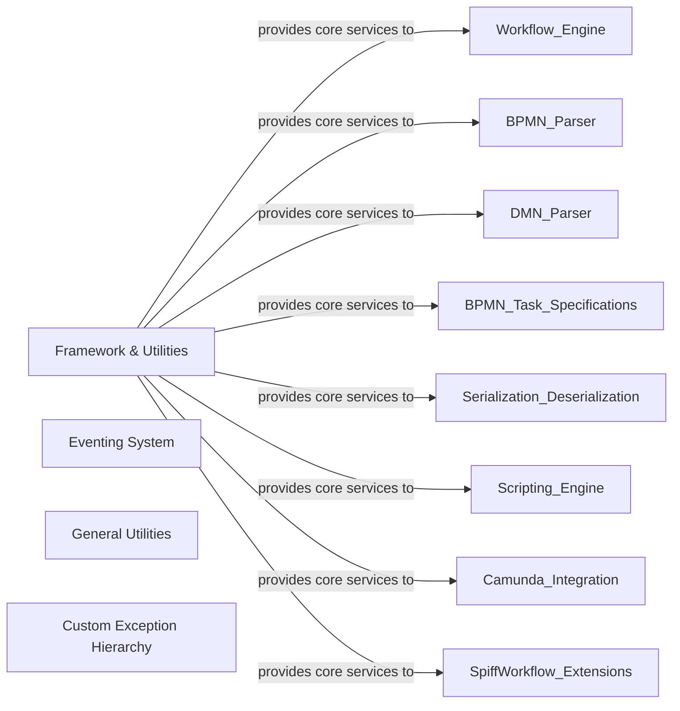

## Details

The `Framework & Utilities` component serves as the foundational layer for the SpiffWorkflow engine, providing essential cross-cutting concerns that enable modularity, robust error handling, and inter-component communication. It is fundamental because it encapsulates common functionalities and architectural patterns (like Event-Driven Architecture) that would otherwise be duplicated across various parts of the system, leading to a more maintainable and extensible codebase.

### Framework & Utilities [[Expand]](./Framework_Utilities.md)

A foundational layer providing general-purpose utility functions, a robust internal eventing mechanism for inter-component communication, and a hierarchy of custom exceptions for robust error handling across the entire SpiffWorkflow engine.

**Related Classes/Methods**: _None_

### Eventing System

Implements a publish-subscribe mechanism, allowing various components within the workflow engine to communicate and react to state changes or actions without direct coupling. This adheres to the Event-Driven Architecture pattern, promoting loose coupling and extensibility.

**Related Classes/Methods**:

- <a href="https://github.com/recursionpharma/SpiffWorkflow/blob/main/SpiffWorkflow/util/event.py#L31-L244" target="_blank" rel="noopener noreferrer">`SpiffWorkflow.util.event.Event` (31:244)</a>

### General Utilities

Provides a collection of reusable helper functions and classes for common, non-domain-specific operations. This includes functionalities like deep merging dictionaries, filtering tasks based on various criteria, and managing weak references to callable objects, which are broadly applicable across the engine.

**Related Classes/Methods**:

- <a href="https://github.com/recursionpharma/SpiffWorkflow/blob/main/SpiffWorkflow/util/deep_merge.py" target="_blank" rel="noopener noreferrer">`SpiffWorkflow.util.deep_merge.deep_merge`</a>

- <a href="https://github.com/recursionpharma/SpiffWorkflow/blob/main/SpiffWorkflow/util/task.py#L127-L175" target="_blank" rel="noopener noreferrer">`SpiffWorkflow.util.task.TaskFilter` (127:175)</a>

- <a href="https://github.com/recursionpharma/SpiffWorkflow/blob/main/SpiffWorkflow/util/weakmethod.py#L40-L88" target="_blank" rel="noopener noreferrer">`SpiffWorkflow.util.weakmethod.WeakMethod` (40:88)</a>

### Custom Exception Hierarchy

Defines a structured and extensible set of custom exceptions that provide specific error types for various operational and business logic failures within the SpiffWorkflow engine. This facilitates precise error identification, graceful degradation, and easier debugging.

**Related Classes/Methods**:

- <a href="https://github.com/recursionpharma/SpiffWorkflow/blob/main/SpiffWorkflow/exceptions.py#L19-L33" target="_blank" rel="noopener noreferrer">`SpiffWorkflow.exceptions.SpiffWorkflowException` (19:33)</a>

- <a href="https://github.com/recursionpharma/SpiffWorkflow/blob/main/SpiffWorkflow/exceptions.py#L36-L52" target="_blank" rel="noopener noreferrer">`SpiffWorkflow.exceptions.WorkflowException` (36:52)</a>

### [FAQ](https://github.com/CodeBoarding/GeneratedOnBoardings/tree/main?tab=readme-ov-file#faq)