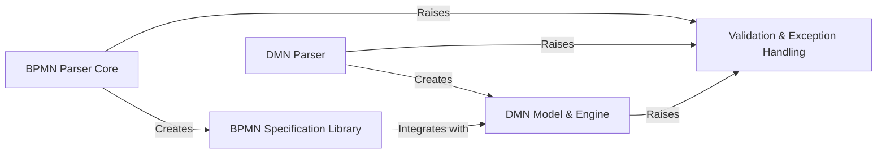

## Details

The `Modeling & Parsing` subsystem is crucial for transforming abstract BPMN and DMN definitions into concrete, executable specifications for the workflow engine. It acts as the bridge between the human-readable models and the machine-executable processes.

### BPMN Parser Core

This is the primary entry point for ingesting BPMN XML files or strings. It orchestrates the parsing of various BPMN elements (processes, tasks, events, gateways) by delegating to specialized sub-parsers. It's responsible for the initial transformation of the raw XML into a structured, internal representation.

**Related Classes/Methods**:

- <a href="https://github.com/recursionpharma/SpiffWorkflow/blob/main/SpiffWorkflow/bpmn/parser/BpmnParser.py#L111-L382" target="_blank" rel="noopener noreferrer">`SpiffWorkflow.bpmn.parser.BpmnParser` (111:382)</a>

- <a href="https://github.com/recursionpharma/SpiffWorkflow/blob/main/SpiffWorkflow/bpmn/parser/ProcessParser.py#L27-L155" target="_blank" rel="noopener noreferrer">`SpiffWorkflow.bpmn.parser.ProcessParser` (27:155)</a>

- <a href="https://github.com/recursionpharma/SpiffWorkflow/blob/main/SpiffWorkflow/bpmn/parser/node_parser.py#L1-L1" target="_blank" rel="noopener noreferrer">`SpiffWorkflow.bpmn.parser.node_parser` (1:1)</a>

### BPMN Specification Library

A comprehensive collection of classes that define the internal, executable representations of all BPMN elements, including processes, tasks (User, Script, Service, Multi-Instance), gateways (Exclusive, Parallel, Inclusive), events (Message, Timer, Error, Signal), and data objects. These specifications encapsulate the behavior and attributes of each BPMN element, forming the blueprint for workflow execution.

**Related Classes/Methods**:

- <a href="https://github.com/recursionpharma/SpiffWorkflow/blob/main/SpiffWorkflow/bpmn/specs/bpmn_process_spec.py#L1-L1" target="_blank" rel="noopener noreferrer">`SpiffWorkflow.bpmn.specs.bpmn_process_spec` (1:1)</a>

- <a href="https://github.com/recursionpharma/SpiffWorkflow/blob/main/SpiffWorkflow/bpmn/specs/bpmn_task_spec.py#L1-L1" target="_blank" rel="noopener noreferrer">`SpiffWorkflow.bpmn.specs.bpmn_task_spec` (1:1)</a>

- <a href="https://github.com/recursionpharma/SpiffWorkflow/blob/main/SpiffWorkflow/bpmn/specs/control.py#L1-L1" target="_blank" rel="noopener noreferrer">`SpiffWorkflow.bpmn.specs.control` (1:1)</a>

- `SpiffWorkflow.bpmn.specs.mixins` (1:1)

- <a href="https://github.com/recursionpharma/SpiffWorkflow/blob/main/SpiffWorkflow/bpmn/specs/defaults.py#L1-L1" target="_blank" rel="noopener noreferrer">`SpiffWorkflow.bpmn.specs.defaults` (1:1)</a>

- `SpiffWorkflow.bpmn.specs.event_definitions` (1:1)

- <a href="https://github.com/recursionpharma/SpiffWorkflow/blob/main/SpiffWorkflow/bpmn/specs/data_spec.py#L1-L1" target="_blank" rel="noopener noreferrer">`SpiffWorkflow.bpmn.specs.data_spec` (1:1)</a>

### DMN Parser

Responsible for parsing DMN XML files. It extracts decision tables, input/output definitions, and rules, converting them into an internal DMN model. This parser can also be integrated with BPMN parsing, particularly for Business Rule Tasks that reference DMN decisions.

**Related Classes/Methods**:

- <a href="https://github.com/recursionpharma/SpiffWorkflow/blob/main/SpiffWorkflow/dmn/parser/DMNParser.py#L37-L204" target="_blank" rel="noopener noreferrer">`SpiffWorkflow.dmn.parser.DMNParser` (37:204)</a>

- <a href="https://github.com/recursionpharma/SpiffWorkflow/blob/main/SpiffWorkflow/dmn/parser/BpmnDmnParser.py#L39-L123" target="_blank" rel="noopener noreferrer">`SpiffWorkflow.dmn.parser.BpmnDmnParser` (39:123)</a>

### DMN Model & Engine

This component encompasses the internal, structured representation of a DMN model (including parsed decision tables, their inputs, outputs, and defined rules) and the core logic for evaluating these decision tables. It takes input data, applies the DMN rules, and produces a decision result that can then be used to guide the workflow's progression.

**Related Classes/Methods**:

- <a href="https://github.com/recursionpharma/SpiffWorkflow/blob/main/SpiffWorkflow/dmn/specs/model.py#L40-L45" target="_blank" rel="noopener noreferrer">`SpiffWorkflow.dmn.specs.model.Decision` (40:45)</a>

- <a href="https://github.com/recursionpharma/SpiffWorkflow/blob/main/SpiffWorkflow/dmn/engine/DMNEngine.py#L30-L150" target="_blank" rel="noopener noreferrer">`SpiffWorkflow.dmn.engine.DMNEngine` (30:150)</a>

- <a href="https://github.com/recursionpharma/SpiffWorkflow/blob/main/SpiffWorkflow/dmn/specs/business_rule_task_mixin.py#L1-L1" target="_blank" rel="noopener noreferrer">`SpiffWorkflow.dmn.specs.business_rule_task_mixin` (1:1)</a>

### Validation & Exception Handling

A set of custom exception classes used throughout the parsing and execution phases. These exceptions are critical for signaling and reporting issues such as invalid BPMN/DMN model structures (validation errors) or failures during the execution of workflow tasks, ensuring robust error handling and clear feedback.

**Related Classes/Methods**:

- <a href="https://github.com/recursionpharma/SpiffWorkflow/blob/main/SpiffWorkflow/bpmn/parser/ValidationException.py#L23-L51" target="_blank" rel="noopener noreferrer">`SpiffWorkflow.bpmn.parser.ValidationException` (23:51)</a>

- <a href="https://github.com/recursionpharma/SpiffWorkflow/blob/main/SpiffWorkflow/exceptions.py#L1-L1" target="_blank" rel="noopener noreferrer">`SpiffWorkflow.exceptions.WorkflowTaskException` (1:1)</a>

- <a href="https://github.com/recursionpharma/SpiffWorkflow/blob/main/SpiffWorkflow/bpmn/exceptions.py#L101-L111" target="_blank" rel="noopener noreferrer">`SpiffWorkflow.bpmn.exceptions.WorkflowDataException` (101:111)</a>

### [FAQ](https://github.com/CodeBoarding/GeneratedOnBoardings/tree/main?tab=readme-ov-file#faq)