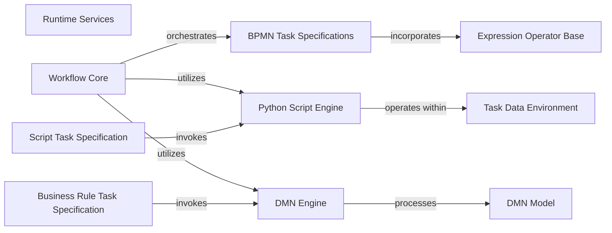

## Details

The `Runtime Services` component in `SpiffWorkflow` is crucial for enabling dynamic behavior and data manipulation within workflow tasks and DMN rules. It acts as the bridge between the static workflow definition and the live execution of code or evaluation of rules. This component embodies the "Interpreter Pattern" by providing mechanisms to interpret and execute embedded logic.

### Runtime Services [[Expand]](./Runtime_Services.md)

The overarching conceptual component that encompasses all capabilities for executing embedded scripts and evaluating expressions and DMN rules during workflow execution. It ensures dynamic behavior and data manipulation.

**Related Classes/Methods**: _None_

### Workflow Core

The central orchestrator of BPMN workflows. It manages the state, execution flow, and task dispatching. It is fundamental as it drives the entire workflow process and interacts with runtime services to execute dynamic elements.

**Related Classes/Methods**:

- <a href="https://github.com/recursionpharma/SpiffWorkflow/blob/main/SpiffWorkflow/bpmn/workflow.py#L35-L295" target="_blank" rel="noopener noreferrer">`SpiffWorkflow.bpmn.workflow.BpmnWorkflow` (35:295)</a>

### BPMN Task Specifications

The abstract base class for all BPMN task types. It defines the common structure and properties for tasks within a workflow, including those that embed scripts or DMN rules. It's fundamental as it provides the blueprint for all executable units in a BPMN process.

**Related Classes/Methods**:

- <a href="https://github.com/recursionpharma/SpiffWorkflow/blob/main/SpiffWorkflow/bpmn/specs/bpmn_task_spec.py#L24-L114" target="_blank" rel="noopener noreferrer">`SpiffWorkflow.bpmn.specs.bpmn_task_spec.BpmnTaskSpec` (24:114)</a>

### Python Script Engine

Responsible for executing Python scripts embedded within BPMN Script Tasks. It provides the environment and mechanisms for running arbitrary Python code, making it fundamental for dynamic script execution.

**Related Classes/Methods**:

- <a href="https://github.com/recursionpharma/SpiffWorkflow/blob/main/SpiffWorkflow/bpmn/script_engine/python_engine.py#L28-L101" target="_blank" rel="noopener noreferrer">`SpiffWorkflow.bpmn.script_engine.python_engine.PythonScriptEngine` (28:101)</a>

### Task Data Environment

Sets up and manages the execution environment for Python scripts, providing secure access to workflow data and variables. It is fundamental for isolating script execution and providing necessary context.

**Related Classes/Methods**:

- <a href="https://github.com/recursionpharma/SpiffWorkflow/blob/main/SpiffWorkflow/bpmn/script_engine/python_environment.py#L36-L81" target="_blank" rel="noopener noreferrer">`SpiffWorkflow.bpmn.script_engine.python_environment.TaskDataEnvironment` (36:81)</a>

### Expression Operator Base

The foundational class for all expression evaluation components. It defines the interface for various operators (e.g., equality, assignment, comparison) used in conditions and data manipulation throughout the workflow and DMN rules. This aligns with the "Interpreter Pattern."

**Related Classes/Methods**:

- <a href="https://github.com/recursionpharma/SpiffWorkflow/blob/main/SpiffWorkflow/operators.py#L208-L252" target="_blank" rel="noopener noreferrer">`SpiffWorkflow.operators.Operator` (208:252)</a>

### DMN Engine

Specifically responsible for evaluating DMN (Decision Model and Notation) decision tables. It takes input data and applies the defined DMN rules to produce a decision result, integrating external decision logic into the workflow. It is fundamental for implementing business rule tasks.

**Related Classes/Methods**:

- `SpiffWorkflow.dmn.DMNEngine` (1:1)

### Script Task Specification

A concrete BPMN task specification that specifically handles the execution of embedded scripts. It is fundamental as it links the BPMN model to the Python Script Engine.

**Related Classes/Methods**:

- <a href="https://github.com/recursionpharma/SpiffWorkflow/blob/main/SpiffWorkflow/bpmn/specs/mixins/script_task.py#L33-L45" target="_blank" rel="noopener noreferrer">`SpiffWorkflow.bpmn.specs.mixins.script_task.ScriptTask` (33:45)</a>

### Business Rule Task Specification

A concrete BPMN task specification that integrates DMN decision tables. It is fundamental as it links the BPMN model to the DMN Engine for rule evaluation.

**Related Classes/Methods**:

- <a href="https://github.com/recursionpharma/SpiffWorkflow/blob/main/SpiffWorkflow/camunda/specs/business_rule_task.py#L3-L4" target="_blank" rel="noopener noreferrer">`SpiffWorkflow.camunda.specs.business_rule_task.BusinessRuleTask` (3:4)</a>

### DMN Model

Represents the parsed structure of a DMN decision, including input, output, and decision logic. It is consumed by the DMN Engine for evaluation. It is fundamental as it defines the data structure for DMN rules.

**Related Classes/Methods**:

- <a href="https://github.com/recursionpharma/SpiffWorkflow/blob/main/SpiffWorkflow/dmn/specs/model.py#L40-L45" target="_blank" rel="noopener noreferrer">`SpiffWorkflow.dmn.specs.model.Decision` (40:45)</a>

### [FAQ](https://github.com/CodeBoarding/GeneratedOnBoardings/tree/main?tab=readme-ov-file#faq)