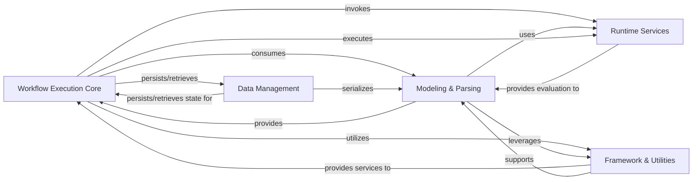

## Details

High-level data flow overview of the SpiffWorkflow project, a Workflow Engine / Business Process Management (BPM) System, structured around its core architectural components.

### Workflow Execution Core

The central orchestrator responsible for executing workflows, managing the state of workflow instances and their tasks, and driving the overall process progression. It dispatches tasks to appropriate handlers and manages data flow within the workflow.

**Related Classes/Methods**:

- <a href="https://github.com/recursionpharma/SpiffWorkflow/blob/main/SpiffWorkflow/workflow.py#L1-L1" target="_blank" rel="noopener noreferrer">`SpiffWorkflow.workflow` (1:1)</a>

- <a href="https://github.com/recursionpharma/SpiffWorkflow/blob/main/SpiffWorkflow/task.py#L1-L1" target="_blank" rel="noopener noreferrer">`SpiffWorkflow.task` (1:1)</a>

### Modeling & Parsing [[Expand]](./Modeling_Parsing.md)

Handles the parsing, validation, and internal representation of both BPMN (Business Process Model and Notation) and DMN (Decision Model and Notation) definitions. It transforms XML models into executable specifications for the workflow engine.

**Related Classes/Methods**:

- `SpiffWorkflow.bpmn.parser` (1:1)

- `SpiffWorkflow.bpmn.specs` (1:1)

- `SpiffWorkflow.dmn.engine` (1:1)

- `SpiffWorkflow.dmn.parser` (1:1)

- `SpiffWorkflow.dmn.specs` (1:1)

### Runtime Services [[Expand]](./Runtime_Services.md)

Provides capabilities for executing embedded scripts and evaluating expressions within workflow tasks and DMN rules. This component ensures dynamic behavior and data manipulation during workflow execution.

**Related Classes/Methods**:

- `SpiffWorkflow.bpmn.script_engine` (1:1)

- <a href="https://github.com/recursionpharma/SpiffWorkflow/blob/main/SpiffWorkflow/operators.py#L1-L1" target="_blank" rel="noopener noreferrer">`SpiffWorkflow.operators` (1:1)</a>

### Data Management [[Expand]](./Data_Management.md)

Manages the serialization and deserialization of workflow, task, and specification instances to and from various persistent formats (e.g., JSON, XML, dictionary). It enables saving and loading the workflow engine's state.

**Related Classes/Methods**:

- `SpiffWorkflow.serializer` (1:1)

- `SpiffWorkflow.bpmn.serializer` (1:1)

- `SpiffWorkflow.dmn.serializer` (1:1)

- `SpiffWorkflow.camunda.serializer` (1:1)

- `SpiffWorkflow.spiff.serializer` (1:1)

### Framework & Utilities [[Expand]](./Framework_Utilities.md)

A foundational layer providing general-purpose utility functions, a robust internal eventing mechanism for inter-component communication, and a pluggable architecture for extending SpiffWorkflow's core capabilities with custom elements or vendor-specific integrations (e.g., Camunda). It also defines a hierarchy of custom exceptions for robust error handling.

**Related Classes/Methods**:

- `SpiffWorkflow.util` (1:1)

- `SpiffWorkflow.camunda` (1:1)

- `SpiffWorkflow.spiff` (1:1)

- <a href="https://github.com/recursionpharma/SpiffWorkflow/blob/main/SpiffWorkflow/exceptions.py#L1-L1" target="_blank" rel="noopener noreferrer">`SpiffWorkflow.exceptions` (1:1)</a>

### [FAQ](https://github.com/CodeBoarding/GeneratedOnBoardings/tree/main?tab=readme-ov-file#faq)